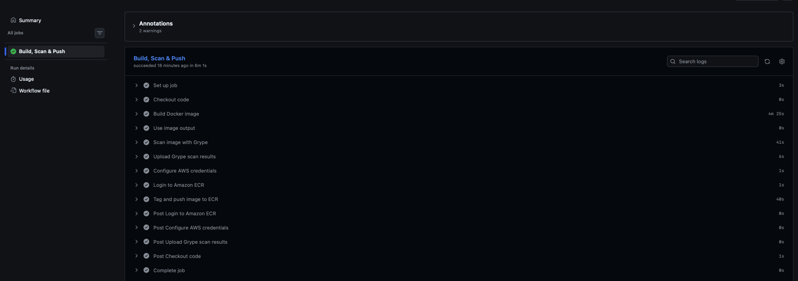
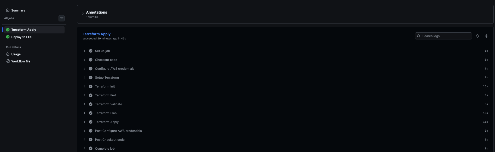
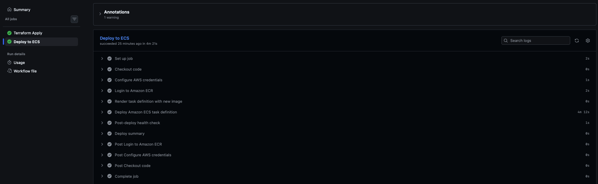
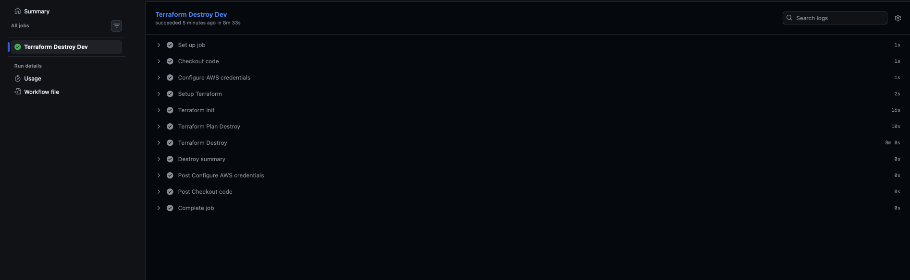

# ECS Fargate End-to-End CI/CD Deployment Project (Node.js app)

## Overview

This project demonstrates a fully automated, cloud-native CI/CD pipeline for a Node.js application, deployed on AWS using ECS Fargate, Docker, Terraform, and GitHub Actions.
The Node.js application is containerised using a multi-stage Docker build that is leveraging a Node.js base image to install dependencies, compile the build and produce a lean production runtime image. It is deployed to AWS ECS Fargate, running behind an Application Load Balancer within a secure multi-AZ VPC architecture.

Infrastructure provisioning is fully automated using Terraform, enabling Infrastructure as Code (IaC) for consistent and repeatable deployments. Remote state is stored in Amazon S3 with native S3 state locking.

CI/CD automation is implemented using GitHub Actions with OIDC authentication (no static AWS credentials). On each push, the pipeline installs Node.js dependencies, builds the application, and produces a Docker image that is tagged using the Git commit SHA and pushed to Amazon ECR before being deployed to ECS.

ECS Fargate was chosen over EC2 to eliminate the need for server management, allowing AWS to handle scaling, provisioning, and the underlying infrastructure automatically keeping the focus on delivering the Node.js application rather than maintaining hosts.

---

## HTTPS Access to Domain

The application is accessible at: **https://tm.threatmodapp.com**

<!-- SCREENSHOT: browser address bar showing https:// padlock + app loaded -->


---

## Architecture

<!-- SCREENSHOT: your architecture diagram (Lucidchart/draw.io/Mermaid export) -->


The architecture includes:
- **Custom VPC** with public and private subnets across two AZs (eu-west-2a, eu-west-2b)
- **Internet Gateway** for public subnet egress
- **NAT Gateways** (one per AZ) for private subnet egress
- **Application Load Balancer** in public subnets handling HTTP→HTTPS redirect
- **ECS Fargate tasks** running in private subnets for security
- **ACM certificate** managed via Terraform for HTTPS
- **Route53 hosted zone** for DNS records
- **ECR repository** with vulnerability scanning enabled
- **CloudWatch Logs** for ECS task logging
- **Auto-scaling** based on CPU utilisation (2-4 tasks)

---

## Features

- Multi-stage Docker containerisation with non-root user
- ECS Fargate deployment with rolling updates and deployment circuit breaker
- Application Load Balancer with HTTP→HTTPS redirect
- TLS 1.3 enforced via `ELBSecurityPolicy-TLS13-1-2-2021-06`
- Public and private subnet architecture (multi-AZ)
- Terraform Infrastructure as Code with modular structure
- Remote state in S3 with native state locking (`use_lockfile = true`)
- CI/CD with GitHub Actions using OIDC (no static AWS keys)
- ACM certificate created and validated automatically via Terraform
- Route53 DNS integration
- CloudWatch logging with 30-day retention
- Container insights enabled on ECS cluster
- Auto-scaling on CPU target tracking (70% threshold)
- ECR image scanning on push

---

## CI/CD Pipelines

The project uses 3 GitHub Actions workflows, all authenticated via OIDC with no static AWS credentials.

### CI Pipeline (`ci.yaml`)
**Triggers:** Push to `main` (on `app/**` changes), `workflow_dispatch`

Builds the Docker image, tags it with the Git SHA, and pushes it to Amazon ECR.

- Builds image from `./app`
- Tags image with `sha-${{ github.sha }}` AND `latest`
- Authenticates to AWS via OIDC
- Pushes to ECR
- Job summary with image reference

<!-- SCREENSHOT: successful CI pipeline run in GitHub Actions -->


### Deploy Pipeline (`deploy.yaml`)
**Triggers:** After CI completes successfully, push to `main` (on `infra/**` changes), `workflow_dispatch`

Combined infrastructure and application deployment:

**Job 1 — Terraform Apply:**
- Runs `terraform fmt`, `validate`, `plan`
- Applies infrastructure changes (VPC, ECS, ALB, ACM, Route53)


**Job 2 — ECS Deploy:**
- Renders new task definition with the SHA-tagged image
- Deploys to ECS service with `wait-for-service-stability`
- Runs post-deploy health check against `https://tm.threatmodapp.com/health`
- Fails the pipeline if the app is unhealthy

<!-- SCREENSHOT: successful Deploy pipeline run -->


### Destroy Pipeline (`destroy.yaml`)
**Triggers:** `workflow_dispatch` only (manual)

Safely tears down all infrastructure with a confirmation safeguard:
- Requires typing `destroy-dev` in the input field
- Skipped automatically if confirmation doesn't match
- Runs `terraform plan -destroy` then `terraform destroy`

<!-- SCREENSHOT: successful Destroy pipeline run -->


### Pipeline Flow
App code change:
push → ci.yaml (build & push image) → deploy.yaml (terraform + ECS deploy)
Infra change:
push → deploy.yaml (terraform + ECS deploy) directly
Manual destroy:
workflow_dispatch → destroy.yaml (requires confirmation)

---

## Repository Structure
```bash
ecs-threat-composer-app/
│
├── app/                          # Application source code
│   ├── Dockerfile
│   ├── .dockerignore
│   └── ...
│
├── infra/                        # Terraform configuration
│   ├── main.tf                   # Root module calls
│   ├── variables.tf              # Root variables
│   ├── outputs.tf                # Root outputs
│   ├── provider.tf               # AWS provider + S3 backend
│   ├── dev.tfvars                # Non-sensitive environment config
│   ├── terraform.tfvars          # Auto-loaded variables
│   ├── .aws/
│   │   └── task-definition.json  # ECS task definition template
│   └── modules/
│       ├── vpc/                  # VPC, subnets, IGW, NAT, route tables
│       ├── alb/                  # Load balancer, listeners, target group
│       ├── ecr/                  # Container registry
│       ├── ecs/                  # Cluster, service, task def, autoscaling
│       └── acm/                  # SSL certificate + DNS validation
│
├── .github/
│   └── workflows/
│       ├── ci.yaml               # Build & push Docker image
│       ├── deploy.yaml           # Terraform apply + ECS deploy
│       └── destroy.yaml          # Terraform destroy (manual)
│
├── .gitignore
└── README.md
```
---

## How It Works

1. Developer pushes code to GitHub `main` branch
2. **CI Workflow** runs (on `app/**` changes): builds Docker image, tags with Git SHA, pushes to ECR
3. **Deploy Workflow** triggers on CI success (or on `infra/**` changes):
   - Job 1: Terraform plans and applies infrastructure
   - Job 2: Renders task definition with new image, deploys to ECS
4. ECS performs rolling update with deployment circuit breaker (auto-rollback on failure)
5. Health check against `https://tm.threatmodapp.com/health` validates deployment

### Traffic Flow
User → HTTPS:443 → ALB (TLS termination)
↓
HTTP forward to ECS task on port 3003
↓
Private subnet → NAT Gateway → Internet (if needed)

---

## How to Run Locally

### Prerequisites
- Docker installed
- Git

### Steps

**1. Clone the repository:**
```bash
git clone https://github.com/HassanHI3/ecs-threat-composer-app.git
cd ecs-threat-composer-app
```

**2. Build the Docker image:**
```bash
docker build -t threatmod ./app
```

**3. Run the container locally:**
```bash
docker run -p 3003:3003 threatmod
```

**4. Test the health endpoint:**
```bash
curl http://localhost:3003/health
# {"status":"ok"}
```

**5. Open in browser:**
http://localhost:3003

---

## Reproducing the Infrastructure

### Prerequisites
- AWS account with appropriate permissions
- Terraform installed (`>= 1.5`)
- Domain with DNS managed via Route53 (or update DNS provider config)
- S3 bucket for Terraform state

### Steps

**1. Configure backend bucket:**
Create an S3 bucket for Terraform state and update `infra/provider.tf` with the bucket name.

**2. Set up GitHub Secrets:**
- `CICD_ECS_ROLE` — ARN of the IAM role for OIDC
- `ECR_REGISTRY` — `<account-id>.dkr.ecr.<region>.amazonaws.com`
- `TASK_ROLE_ARN` — ECS task role ARN
- `EXECUTION_ROLE_ARN` — ECS execution role ARN

**3. Initialise and apply Terraform:**
```bash
cd infra
terraform init
terraform plan -var-file="dev.tfvars"
terraform apply -var-file="dev.tfvars"
```

**4. Verify deployment:**
```bash
curl https://tm.threatmodapp.com/health
```

---

## Tearing Down

To destroy all infrastructure via the pipeline:

1. Go to GitHub Actions → **Terraform Destroy**
2. Click **Run workflow**
3. Type `destroy-dev` in the confirmation field
4. Click **Run workflow**

Or locally:
```bash
cd infra
terraform destroy -var-file="dev.tfvars"
```

---

## Tech Stack

| Layer | Technology |
|---|---|
| Container | Docker (multi-stage build) |
| Compute | AWS ECS Fargate |
| Load Balancing | AWS Application Load Balancer |
| Networking | AWS VPC (multi-AZ, public + private subnets) |
| DNS | AWS Route53 |
| SSL/TLS | AWS Certificate Manager |
| Registry | AWS Elastic Container Registry |
| Logging | AWS CloudWatch Logs |
| IaC | Terraform (modular, S3 backend) |
| CI/CD | GitHub Actions (OIDC auth) |
| Region | eu-west-2 (London) |

---

## Security Highlights

- ECS tasks run in **private subnets** — not directly internet-accessible
- HTTP traffic forcibly redirected to HTTPS via 301
- TLS 1.3 enforced
- No static AWS credentials anywhere — OIDC used for CI/CD authentication
- IAM permissions scoped to required actions only
- Secrets managed via GitHub Secrets, never committed to repo
- ECR image scanning on push to detect vulnerabilities
- Container runs as non-root user
- Security groups follow least-privilege (ALB → ECS tasks only on app port)

---

## Author

Hassan Ibrahim
